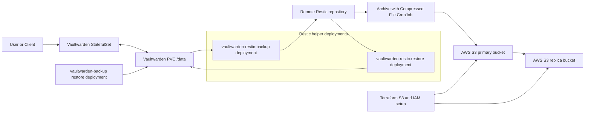

# Vaultwarden Backup, Restore, and Archive Project

This repository combines Kubernetes deployment assets, a custom Restic helper image, and Terraform for object storage so that Vaultwarden can be run, backed up, restored, and archived with a repeatable workflow.

## Dataflow

The following lossy flowchart demonstrate rough idea on the data flow between instances.

The project is organized around three main parts:

## 1. Helm chart for Vaultwarden, backup, restore, and archive workflows

The Helm chart in `devops/helm` is the main deployment package.

Its purpose is not only to run Vaultwarden itself, but also to provide the supporting workloads needed for operational data management:

- a Vaultwarden `StatefulSet` with persistent storage
- a `vaultwarden-backup` helper `Deployment` based on the `ttionya/vaultwarden-backup` project for manual restore from a zip backup
- a `vaultwarden-restic-backup` `Deployment` that mounts the Vaultwarden data volume and runs the Python Restic workflow to back up the Vaultwarden data directory to a remote Restic repository
- a `vaultwarden-restic-restore` `Deployment` for manual restore from the remote Restic repository back into the Vaultwarden data volume
- a backup `CronJob` that automates recurring backup of the Vaultwarden data directory to the remote Restic folder
- an archive `CronJob` that copies the remote Restic folder and uploads a compressed archive of it to AWS S3

Operationally, this means the chart covers five different concerns:

- normal Vaultwarden runtime
- manual restore from a zip backup using `vaultwarden-backup`
- scheduled backup of `/data` to a remote Restic repository
- manual restore from the remote Restic repository
- scheduled archive of the remote Restic repository into S3 for another layer of retention

The chart also creates the supporting services, ingress, service accounts, RBAC, PVC, and secrets required to make those primary workflows work together.

More detail is in [`devops/helm/README.md`](./devops/helm/README.md).

## 2. Terraform for S3 primary and replica storage

The Terraform code in `terraform/` sets up the object storage used by the archive workflow.

Its purpose is to create:

- a primary S3 bucket
- a replication bucket in another region
- the IAM role and policy required for S3 replication
- an IAM user access key and secret access key for the archive workflow that uploads the remote Restic archive into S3

This Terraform layer supports the Helm archive `CronJob` by providing the AWS destination and credentials needed for long-term archive storage of the remote Restic folder.

More detail is in [`terraform/README.md`](./terraform/README.md).

## 3. Python Restic workflow and custom image

The Python CLI in [`main.py`](./main.py), together with [`pyproject.toml`](./pyproject.toml) and [`devops/Dockerfile.restic`](./devops/Dockerfile.restic), builds the custom image used by the Restic backup and restore workloads.

This part of the project is responsible for:

- scaling the Vaultwarden `StatefulSet` down before backup or restore
- validating the configured Vaultwarden data directory, rclone configuration path, and Restic password configuration
- running `restic backup` from the Vaultwarden data directory to the remote Restic repository
- running retention cleanup with `restic forget --prune`
- running `restic restore` from the remote Restic repository back into the mounted Vaultwarden data path
- scaling the Vaultwarden `StatefulSet` back up after the operation

This image is used by:

- the automated Restic backup path in Kubernetes
- the manual Restic restore path in Kubernetes
- local or ad hoc operator-driven backup and restore runs outside Kubernetes, if the required environment is provided

## How the parts fit together

At a high level, the intended workflow is:

1. Use Terraform to provision the S3 buckets, replication configuration, and AWS credentials for the archive flow.
2. Build and publish the custom Restic image from `devops/Dockerfile.restic`. Command is included in the Dockerfile
3. Install the Helm chart with the required Vaultwarden, Restic, rclone, ingress, and secret configuration.
4. Let Vaultwarden run normally from the persistent volume.
5. Use the Restic backup `CronJob` to periodically back up the Vaultwarden data directory to the remote Restic repository.
6. Optionally use the second `CronJob` to back up the remote Restic repository itself to S3.
7. When restore is needed, use either:
   - the `vaultwarden-backup` helper for zip-based restore, or
   - the `vaultwarden-restic-restore` helper for remote Restic restore.

## Repository map

- `devops/helm/`: Helm chart for the full Kubernetes workflow
- `devops/k8s/`: earlier prototype manifests used before the chart packaging
- `devops/Dockerfile.restic`: custom image with Python, Restic, and rclone
- `main.py`: Python CLI for Restic backup and restore orchestration
- `pyproject.toml`: Python package metadata and dependencies
- `terraform/`: S3 and IAM provisioning for archive storage
- `docs/`: development notes and operational documentation
- `envrc.template`: example runtime environment variables

## References

- Vaultwarden repository: https://github.com/dani-garcia/vaultwarden
- Vaultwarden backup guidance: https://github.com/dani-garcia/vaultwarden/wiki/Backing-up-your-vault
- Vaultwarden environment template: https://raw.githubusercontent.com/dani-garcia/vaultwarden/refs/heads/main/.env.template
- Restic repository preparation via rclone: https://restic.readthedocs.io/en/latest/030_preparing_a_new_repo.html#other-services-via-rclone
- rclone obscure command: https://rclone.org/commands/rclone_obscure/
